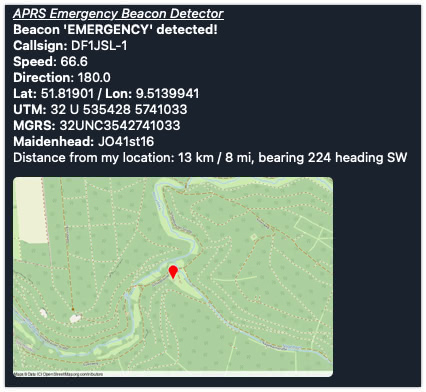

# aprs-emergency-detector

[](https://www.gnu.org/licenses/gpl-3.0) [](https://github.com/psf/black) [](https://github.com/joergschultzelutter/aprs-emergency-detector/actions/workflows/codeql.yml)

This program establishes a read-only connection to [APRS-IS](https://www.aprs-is.net/) and is going to listen to position reports in [Mic-E](http://www.aprs.org/aprs12/mic-e-examples.txt) format. Whenever a Mic-E position report's [message type](https://jgromes.github.io/RadioLib/group__mic__e__message__types.html) matches the program's user configuration, the program is going to generate [Apprise](https://github.com/caronc/apprise/)-based notifications to the messenger accounts provided by the user. Full-length messages as well as APRS-length-compliant short messages can be generated. Optional usage of the [APRS 1.2 Emergency Code extensions](http://wa8lmf.net/bruninga/aprs/EmergencyCode.txt) for messages and APRS objects is supported, too.

## Examples
This is what you will get if you generate a test message via ```--generate-test-message```. All coordinates are fixed, meaning that the result will always look like this. The test message assumes that we have received an ```EMERGENCY``` Mic-E position beacon. All examples have been taken from the Telegram messenger.

### 'Full' message format
This message format contains literally everything that is needed to identify the beacon's position. The included map is zoomable (may be dependent on your target messenger).



### 'Short'/'SMS' message format
This message format contains the absolute minimum of date but will still permit you to locate the user's position. All messages are APRS-compliant in length, meaning that you can use [Apprise](https://github.com/caronc/apprise/) for forwarding this message to another ham radio user and/or SMS phone user.


## Installation

- Clone the repository
- ```pip install -r requirements.txt```
- Rename the file [aed.cfg.TEMPLATE](https://github.com/joergschultzelutter/aprs-emergency-detector/blob/master/src/aed.cfg.TEMPLATE) to a file name of your choice. Program's default name is ```aed.cfg```
- Amend the program configuration file's default settings

      [aed_config]
      
      # lat / lon coordinates where we are located at
      # Format: lat,lon
      # Example: 51.838879,8.32678
      aed_my_position = 51.838879,8.32678
      
      # APRS Mic-E categories that we are going to monitor
      # Valid values: OFF_DUTY, EN_ROUTE, IN_SERVICE,
      #               RETURNING, COMMITTED, SPECIAL,
      #               PRIORITY, EMERGENCY
      # Specify 1..n categories from that list. Separate by comma.
      aed_active_categories = PRIORITY,EMERGENCY
      
      # Range limitation; in case an integer is specified,
      # we will only consider Mic-E position messages from within
      # this range relative to the user's lat/lon position
      # specify value NONE if you do not want to limit
      # the range detection
      #
      # Details: https://www.aprs-is.net/javAPRSFilter.aspx
      #
      # Value's unit of measure: km
      #
      aed_range_limit = NONE

      # Enable / Disable APRS 1.2 Emergency extensions
      # If set to TRUE or YES, this will enable the APRS 1.2
      # extensions (http://wa8lmf.net/bruninga/aprs/EmergencyCode.txt)
      # Note that by enabling this setting, the list of to-be-processed
      # messages will laregly grow as the program will not only have to
      # digest Mic-E position reports but also regular messages as well
      #
      aed_aprs_extension = FALSE
      
      # TOCALL categories which will trigger a message
      # only used if aed_aprs_extension is enabled
      # valid values are ALARM, ALERT, WARNING,
      # WXALARM and EM
      # Specify 1..n categories from that list. Separate by comma.
      #
      aed_tocall_categories = ALARM

- Set the ```aed_my_position```value to your current fixed location. If we get a Mic-E message match, ```aed``` will calculate the distance from your coordinates to the message's coordinates. 
- change the ```aed_active_categories```value and specify the Mic-E categories that you intend to monitor. Separate categories by comma.
- OPTIONAL: set the ```aed_range_limit``` variable to an integer value (unit of mesure: km; see https://www.aprs-is.net/javAPRSFilter.aspx) if you intend to limit the lookup process to a range relative to your lat/lon coordinates. Keep the standard value NONE if you do not want to apply range limits.
- OPTIONAL: set the ```aed_aprs_extension``` variable to TRUE or YES if you want to enable the [APRS 1.2 Emergency Code extensions](http://wa8lmf.net/bruninga/aprs/EmergencyCode.txt). Note that this setting will tell the program to receive standard APRS messages and APRS object reports, thus increasing the number of messages to be processed.
- OPTIONAL: set the ```aed_tocall_categories``` to 0..n entries from the list of given values (can also be empty). Note that this setting is only used if ```aed_aprs_extension``` is enabled.
- Save the file
- Copy the [apprise_demo_template.yml](https://github.com/joergschultzelutter/aprs-emergency-detector/blob/master/src/apprise_demo_template.yml) file and rename it to a file name of your choice. Each message target (full message and abbreviated message) requires its own config file; so if you intend to send full messages and abbreviated messages, you need to create two config files. I suggest using proper messenger config file names, e.g. ```full_msg.yml``` and ```sms_msg.yml``` but this choice is up to you. In order to run the program, you need to specify at least one Apprise config file.
- Edit each config file and add the desired [Apprise messenger configuration](https://github.com/caronc/apprise/). Then save the file.

## Command line parameters

        python aed.py   --configfile                 <program config file name> Default name: aed.cfg
                        --messenger-config-file      [Apprise full-message config file]
                        --sms-messenger-config-file  [Apprise abbreviated-message config file]
                        --generate-test-message
                        --ttl                        [time-to-live for expiring dictionary]

- ```configfile``` is the program's configuration file (containing your lat/lon coordinates et al)
- ```messenger-config-file``` and ```sms-messenger-config-file``` represent the [Apprise messenger configuration]([Apprise](https://github.com/caronc/apprise/) files. Although both settings are listed as optional, you need to specify at least one of these two messenger configuration files - or the program will exit.
- ```generate-test-message``` is a boolean switch. If specified, the program will not connect to APRS-IS but is simply going to generate a single test message which is then broadcasted by the two Apprise messenger files (whereas specified). Once broadcasted, the program will self-terminate.
- ```ttl``` specifies the time-to-live for the message buffer (unit of measure: minutes). If we receive a matching position report from a call sign and lat/lon/course/speed/category have NOT changed, then we will ignore that position report and NOT broadcast an Apprise message to the user

## Known issues and constraints

- As mentioned earlier, 'short' messages are generated in an APRS compliant format and therefore limited in length to 67 characters. Due to that constraint, 'short' messages will limit its position information to Maidenhead grid info and is going to omit any distance-related information that is in imperial units (sorry, but I am a metric system guy 😄)
- Unfortunately, APRS-IS does not offer filter settings which allow the program to filter on e.g. Mic-E messages and/or message types. The program does use a filter based on position reports - but everything else is filtered on the fly, meaning that unless you limit the range (see ```aed_range_limit```), the program has to digest a lot of messages, thus resulting in potential CPU load spikes - especially when enabling the APRS 1.2 extensions.
